Bernard Cesarz 313 534

Aplikacja używa docker compose, ponieważ do jej uruchomienia używany jest kontener uruchamiający aplikację oraz osobny kontener z zawierający obraz selenium przeglądarki chrome.

Dockerfile:

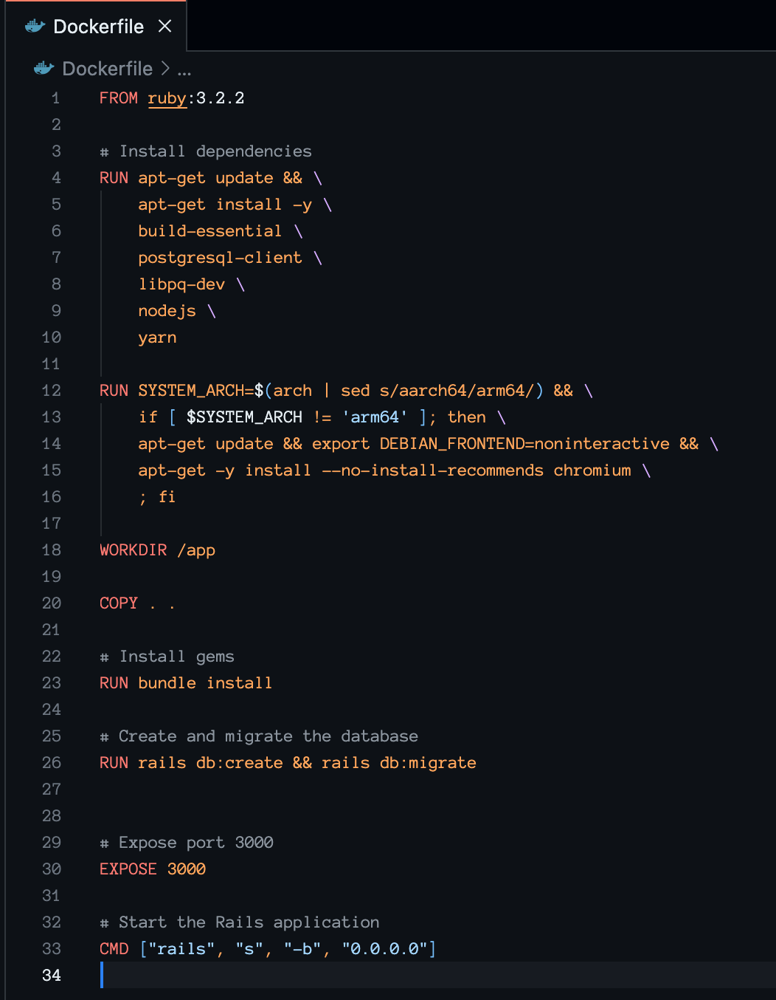

docker-compose.yml:

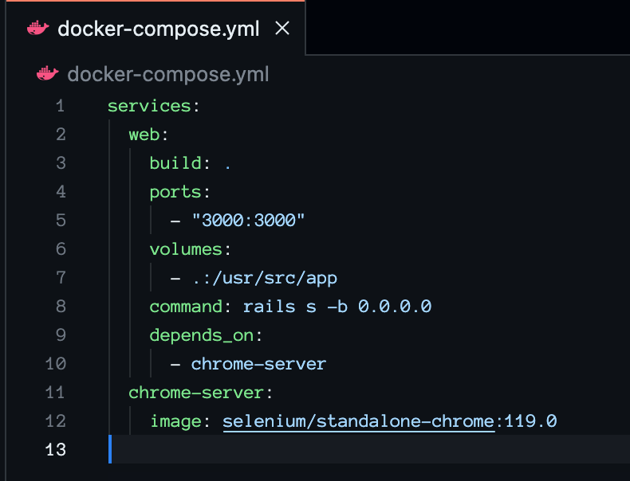

Testy aplikacji odbywają się z użyciem frameworka minitest (domyślny dla frameworka Ruby on Rails). Wszystkie warstwy MVC są realizowane we frameworku Ruby on Rails (w celu uproszczenia procesu i uniknięcia dodawania kolejnych kontenerów do całej operacji).
Do testowania z użyciem selenium użyłem gema nazywającego się Capybara, który daje właśnie taką możliwość, poniżej znajdują pliki w których jest on konfigurowany. Plik test_helper konfiguruje, jak Capybara uruchomi aplikację, a plik application_system_test_case, jakiej przeglądarki użyje do przeprowadzenia testów, w tym przypadku jest to selenium uruchomione w osobnym kontenerze.

test_helper.rb:

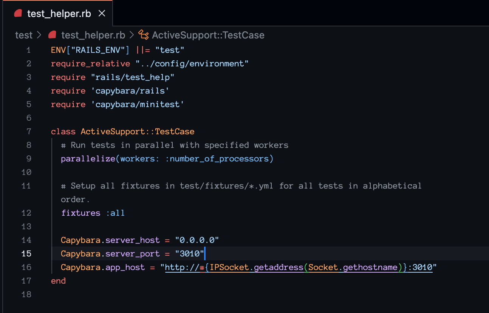

application_system_test_case.rb:

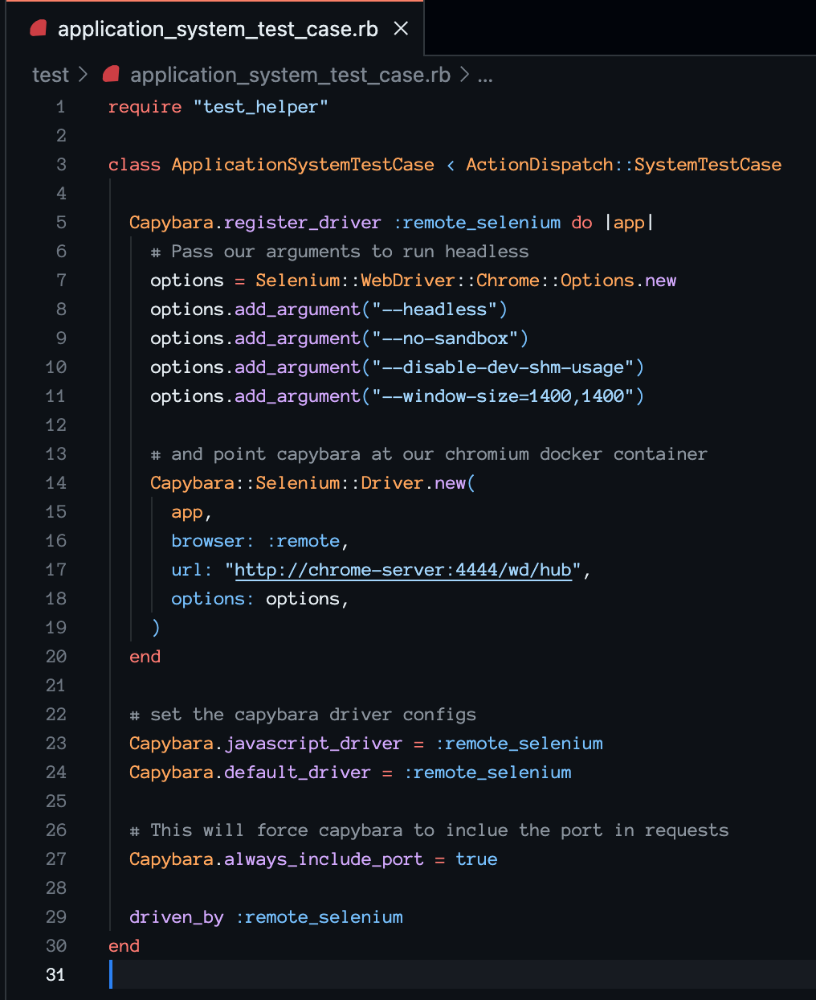

W pliku posts_tests znajdują się testy widoków dla poszczególnych operacji CRUD.

posts_test.rb:

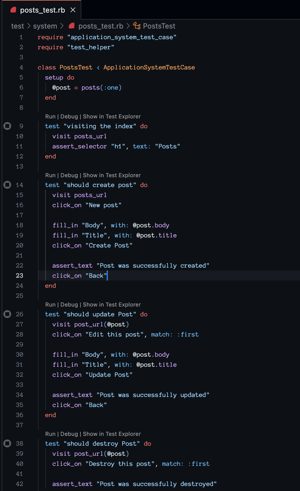
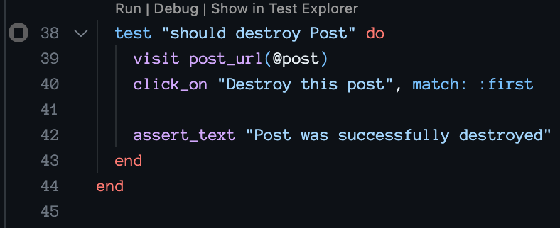

W zdalnym repozytorium Github ustawione są zasady chroniące branch main przed umieszczeniem na nim niepoprawnego kodu, które automatycznie uruchamiają workflow Github Actions, aby sprawdzić jego działanie przed umożliwieniem zcalenia go z główną gałęzią.

Zasady ochrony branch main:

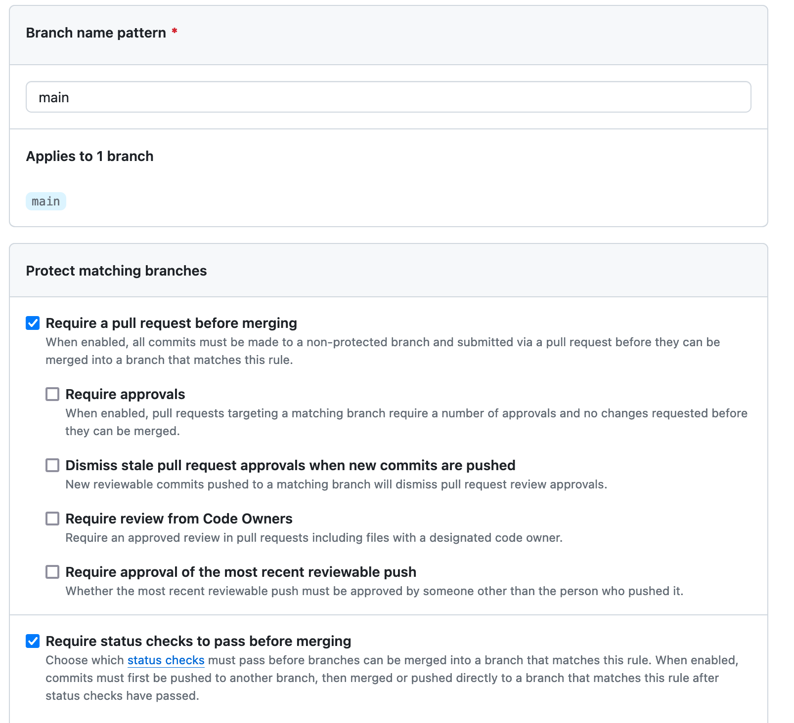

W celu przeprowadzenia zaawansowanych testów sprawdzających poprawność kodu do zcalenia użyty jest workflow Github Actions. Używając narzędzia docker-compose, ten plik stawia aplikację i uruchamia w niej testy, a w wypadku ich niepowodzenia używając odpowiedniego narzędzia, przesyła informację do Azure Devops, w celu utworzenia Work Item informującego o zaistniałym bugu.

Github Actions workflow:

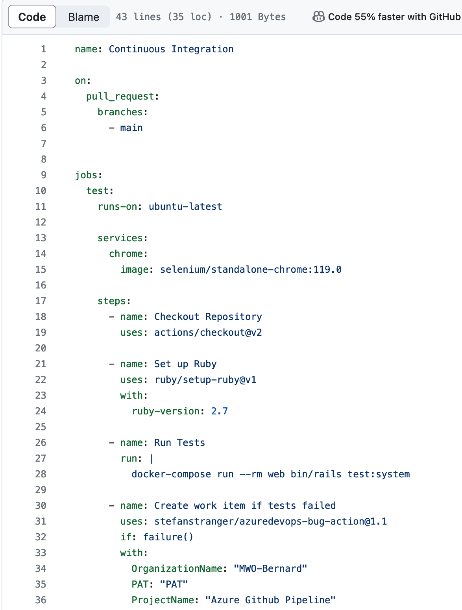
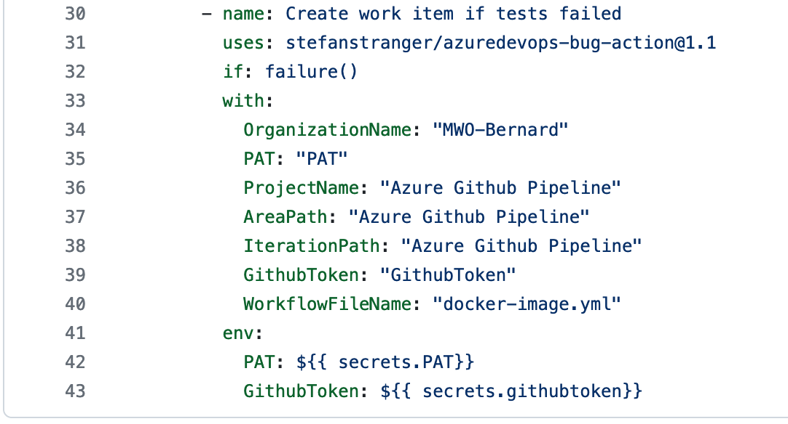

Workflow nie działałby poprawnie bez zdefiniowania sekretów dla repozytorium Github, dlatego wygenerowane zostały sekrety uprawniające do wprowadzania zmian w repozytorium Github or projekcie Azure Devops.

Github secrets:

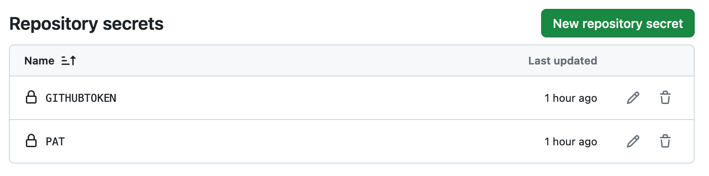

Poniżej znajduje się komunikat dla przypadku, w którym scenariusz działania aplikacji oczekiwany przez testy (po celowej ingerencji), nie pokrywa się z faktycznym działaniem aplikacji.

Failed checks:

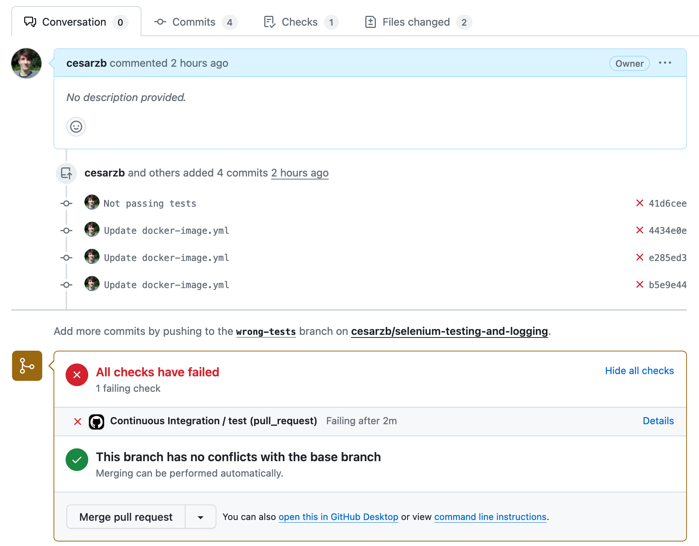

W wyniku wykonania workflow w Github Actions został utworzony nowy work item w projekcie w Azure Devops.

Stworzony work item w Azure Devops:

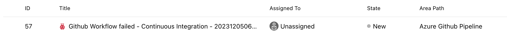
